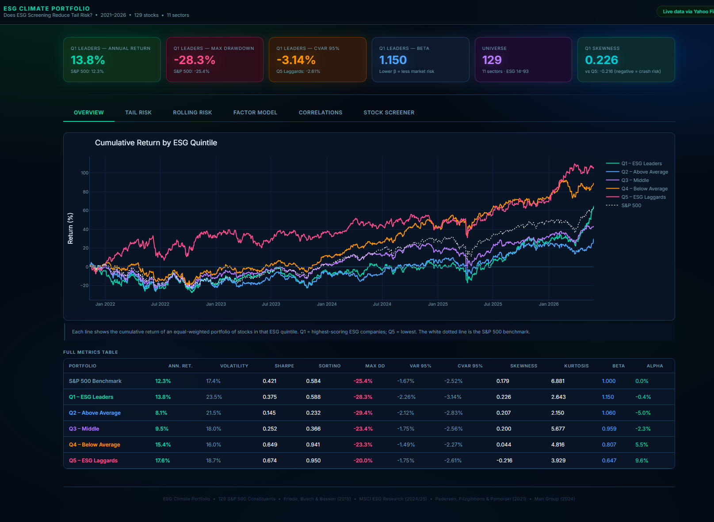

# ESG Climate Portfolio

**Does ESG screening reduce portfolio tail risk?**
A quantitative analysis of 129 S&P 500 constituents across five ESG quintiles, covering 2021–2026.



---

## Overview

This project builds a data pipeline that pulls live stock price data from Yahoo Finance, computes a full suite of risk and performance metrics, and exports everything as a self-contained interactive HTML dashboard — no server required.

The central research question is whether companies with higher ESG (Environmental, Social, and Governance) scores exhibit lower tail risk than low-scoring peers. Stocks are divided into five equal quintiles by ESG score (Q1 = highest, Q5 = lowest), each treated as an equal-weighted portfolio, and compared across a range of risk metrics including max drawdown, Value at Risk (VaR), Conditional VaR (CVaR), beta, return skewness, and excess kurtosis.

---

## Project Structure

```
esg_portfolio/
├── universe.py            # 129-stock universe with ESG scores, sectors, carbon intensity
├── pipeline.py            # Full analytics engine: returns, risk metrics, CAPM, rolling stats
├── export_html.py         # Generates esg_portfolio.html — run this to produce the dashboard
├── esg_portfolio.html     # Output: self-contained interactive dashboard (open in any browser)
├── README.md              # This file
├── FINDINGS.md            # Full findings report with tables and interpretation
└── ESG_Literature_Review.pdf  # Summary of the 7 key research papers underpinning the project
```

---

## Quick Start

**Install dependencies:**
```bash
pip install yfinance pandas numpy scipy plotly
```

**Generate the dashboard:**
```bash
python export_html.py
```

**Open the output:**

Double-click `esg_portfolio.html`, or drag it into Chrome, Edge, or Firefox. No server needed.

---

## Dashboard Tabs

| Tab | What it shows |
|---|---|
| **Overview** | Cumulative return curves for all 5 quintiles vs S&P 500, plus the full metrics table |
| **Tail Risk** | Drawdown series, VaR/CVaR, volatility, skewness and kurtosis by quintile |
| **Rolling Risk** | 63-day rolling beta, Sharpe ratio, and volatility — selectable per quintile |
| **Factor Model** | CAPM regression scatter + alpha, beta, R², p-value table for all quintiles |
| **Correlations** | Cross-quintile correlation heatmap + ESG score vs risk scatter (all 129 stocks) |
| **Stock Screener** | Full sortable, searchable table of all stocks with live metrics |

---

## Metrics Computed

**Performance**
- Annualised return
- Cumulative wealth index

**Risk**
- Annualised volatility
- Beta (vs S&P 500)
- Jensen's alpha (annualised)

**Tail risk**
- Maximum drawdown
- Calmar ratio
- Value at Risk — VaR 95% (historical simulation)
- Conditional VaR — CVaR 95% (Expected Shortfall)
- Return skewness
- Excess kurtosis

**Risk-adjusted**
- Sharpe ratio
- Sortino ratio (downside deviation only)

**Factor model**
- OLS regression: Rp = α + β·Rm + ε
- R², p-value, standard error per quintile

**Rolling (63-day window)**
- Rolling beta
- Rolling Sharpe ratio
- Rolling volatility

**ESG**
- Carbon intensity (tCO₂e / $M revenue)
- MSCI-style letter grade (AAA → CCC)

---

## Stock Universe

129 stocks drawn from the S&P 500 across 11 sectors:

- Technology, Healthcare, Financials, Consumer Discretionary
- Consumer Staples, Industrials, Utilities, Energy
- Real Estate, Materials, Communication Services

ESG scores range from 14 (tobacco / defence) to 93 (Microsoft equivalent), providing a wide spread across quintiles. Three European tickers (IBE, ENEL, ORSTED) may fail to download via Yahoo Finance — the pipeline handles this gracefully by rebalancing quintiles on the remaining stocks.

To replace them with exchange-specific tickers that Yahoo Finance carries reliably:

| Replace | With | Exchange |
|---|---|---|
| `IBE` | `IBE.MC` | Iberdrola, Madrid |
| `ENEL` | `ENEL.MI` | Enel, Milan |
| `ORSTED` | `ORSTED.CO` | Ørsted, Copenhagen |

---

## Research Foundation

| Source | Role in project |
|---|---|
| Friede, Busch & Bassen (2015) — *ESG and Financial Performance: Aggregated Evidence from More Than 2000 Empirical Studies* | Core justification for ESG screening methodology |
| MSCI ESG Research — *ESG Ratings in Global Equity Markets: A Long-Term Performance Review* (2025) | Benchmark for quintile performance analysis |
| MSCI ESG Research — *ESG Ratings and Cost of Capital* (2024) | Academic grounding for the risk-reduction thesis |
| Pedersen, Fitzgibbons & Pomorski (2021) — *Responsible Investing: The ESG-Efficient Frontier* | Portfolio theory framework; CAPM interpretation |
| Man Group — *ESG Performance and Flows* (2024) | Current market context and nuance |
| PRI — *ESG Factors and Returns: A Review of Recent Research* (2025) | Institutional overview and balanced evidence |

---

## How the Pipeline Works

```
universe.py          →  129 stocks with ESG metadata
      ↓
fetch_live_prices()  →  Yahoo Finance download (Nov 2021 – Jun 2026)
      ↓
compute_returns()    →  Daily + monthly returns
      ↓
build_quintile_portfolios()  →  5 equal-weighted portfolios
      ↓
risk_metrics()       →  Full metric suite per quintile + per stock
capm_regression()    →  Alpha, beta, R², p-value
rolling_metrics()    →  63-day rolling beta / Sharpe / vol
      ↓
export_html.py       →  All figures rendered via Plotly
                     →  esg_portfolio.html (self-contained)
```

---

## Notes

- All prices are adjusted close prices (splits and dividends accounted for)
- Risk-free rate: 5% annually (approximate US 3-month T-bill average over the period)
- VaR and CVaR use historical simulation, not parametric estimation
- Quintiles are re-assigned after any failed downloads to keep each group balanced
- The HTML file is fully standalone — share it as a single file with no dependencies
- Data period: November 2021 – June 2026 (1,141 trading days)
